### 一、接口测试流程
#### 1.拿到api接口文档，熟悉接口业务，地址，端口，鉴权，入参和结果，错误码。
#### 2.编写接口测试用例以及评审
* 正例： 输入正常的参数,验证接口能够正常返回(接口只对内部系统)
* 反例： (接口只对外部系统)
* * 鉴权异常: 为空、错误、过期.....
* * 参数异常: 为空、长度异常、类型异常、其他业务异常.....
* * 其他异常: 黑名单、调用次数限制、分页场景
* * 兼容异常: 一个接口被多端调用、版本的兼容
#### 3.使用接口测试工具(Jmeter)
#### 4.无人值守，持续集成，输出报告到企微，钉钉等

### 二、Jmeter组件 
#### 组件的执行顺序
1. 测试计划： Jmeter测试的起点。 容器              
2. 线程组： 代表一定的用户                       
3. 配置元件： 配置请求 
4. 前置处理器： 请求之前的操作 
5. 定时器： 延迟请求 
6. 逻辑控制器： 请求之前处理请求逻辑 
7. 取样器： 发送请求的最小单元 
8. 后置处理器：请求之后的操作
9. 断言： 请求之后判断请求结果是否正常 
10. 监听器： 请求之后收集测试结果  

jmeter.bat 是启动文件
jmeter.properties 是全局配置文件

#### 组件的作用域
* 结论一：组件可以作用于同级组件
* 结论二：组件可以作用于同级组件下的子组件
* 结论三：组件可以作用于上级组件(父组件)

#### 目前市面上的三类接口
1. 基于webservice协议接口，通过xml传输数据
2. 基于dubbo协议接口，通过json传输数据
3. 基于http协议接口(Restful)，通过json传输数据

##### http协议：请求和响应
1. 请求： 请求方式、请求路径、请求头、请求数据
2. 响应： 响应码、响应信息、响应头、响应数据
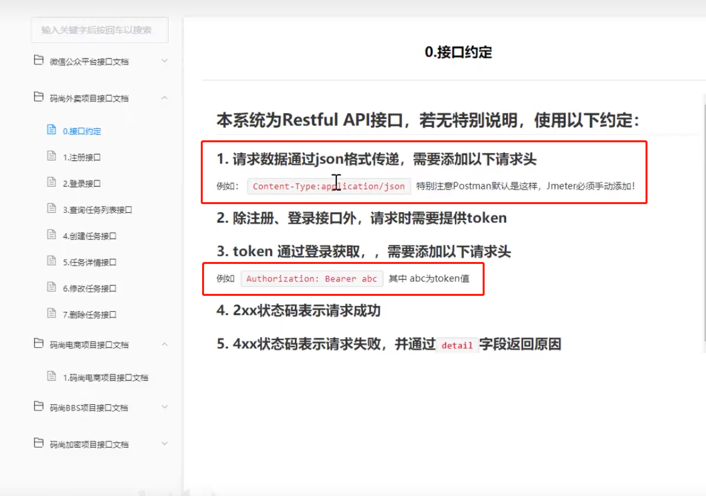

3. token: 鉴权码

### Jmeter 实战
#### 一、接口关联：
1. 正则表达式提取器:
"access_token":"(.*?)"   
注意, token值是通过 (.*?) 来获取到的。。。。

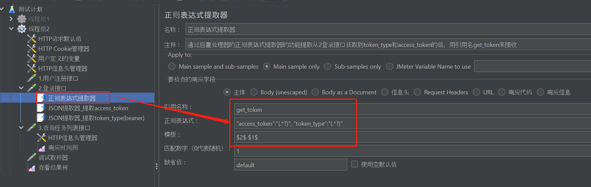

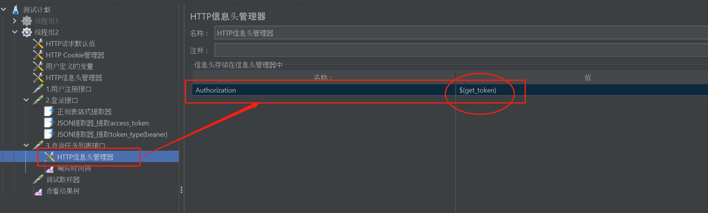

2.JSON提取器：

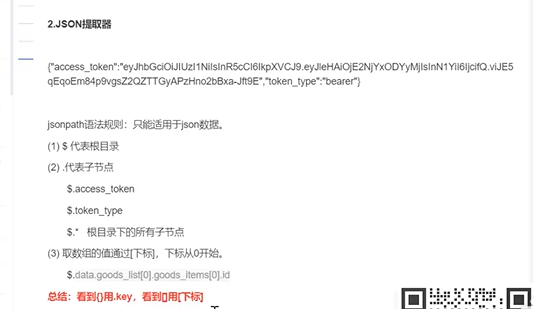

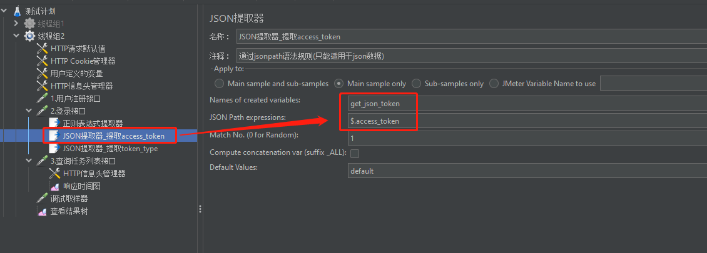

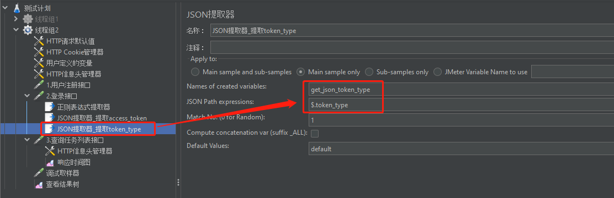

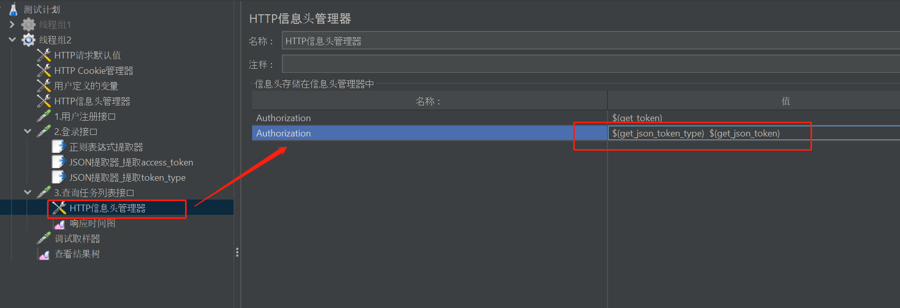

课程的案例最终的情况截图：

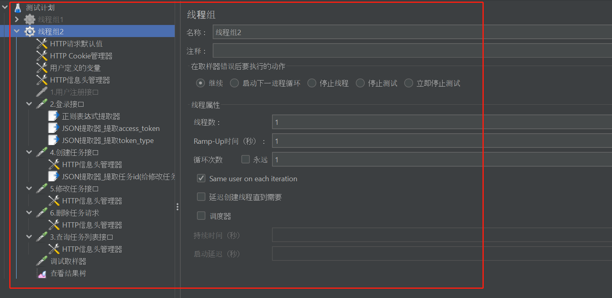

#### 二、在测试中：
##### 业务闭环： 增删改查

1. RestFul架构：
* GET查询
* POST增加
* PUT修改
* DELETE删除

## 第二天接口功能测试:

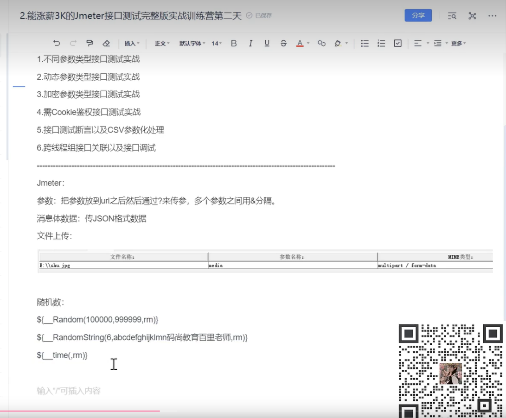

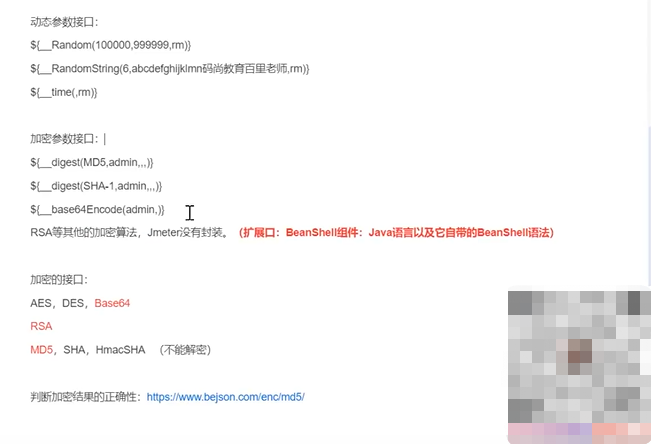

#### 四、需要实现Cookie鉴权的接口实战:

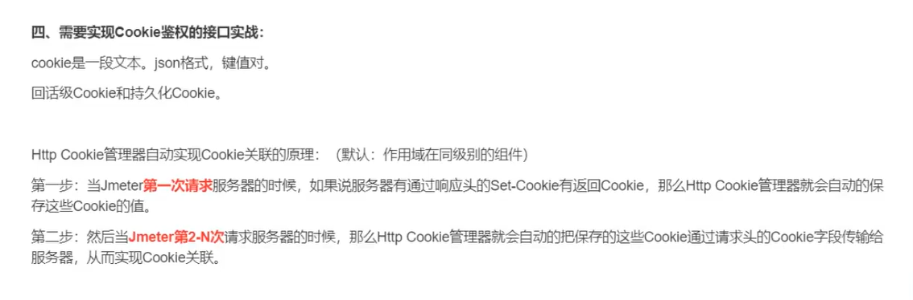

#### 五、接口断言
1. 响应断言
2. JSON断言
3. BeanShell断言
4. 断言状态码

#### 六、接口测试CSV参数化

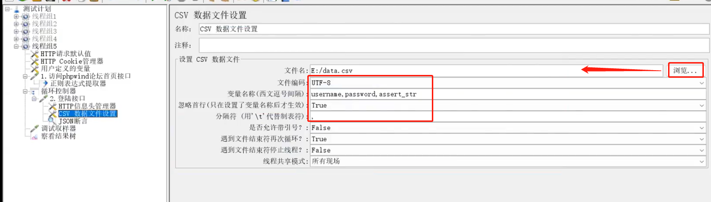

#### 七、接口测试调试
1. 调试取样器(作用就是能够看到全局变量)
2. 看请求和响应的四要素

#### 八、全局观： 对测试岗位、目前行情，需要掌握技能

### 补充内容
#### http协议：请求和响应
1. 请求： 请求方式、请求路径、请求头、请求数据
2. 响应： 响应码、响应信息、响应头、响应数据
3. 重要参数：token(令牌、鉴权码) / Cookie(json格式文本)

##### ======================================================================================================
#### 四、pytest接口自动化框架中重要的模块：requests
#### 接口请求方式: requests.get()、requests.post()、requests.put()、requests.delete()、requests.request()
#####响应: response对象
1. rep = requests.request()
2. rep.text : 返回字符串的数据
3. rep.content ：返回字节格式的数据
4. rep.json()： 返回字典格式的数据
5. rep.status_code： 状态码
6. rep.reason： 返回状态信息
7. rep.cookies： 返回cookie信息
8. rep.encoding : 返回编码格式
9. rep.headers: 返回响应头信息

##### 请求参数类型: 键值对（比如:list[{},{},...]）、JSON格式、文件格式

#### 五、接口自动化测试框架封装

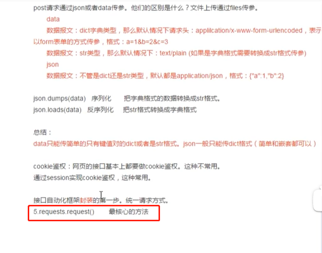

session会话