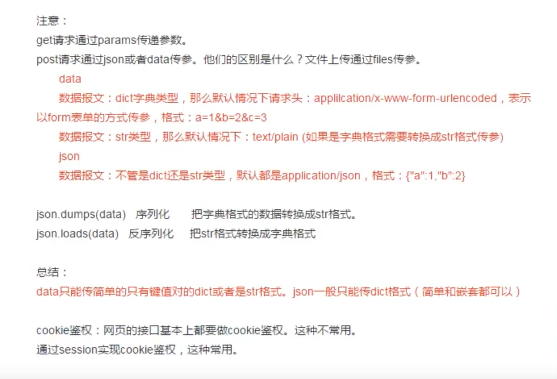
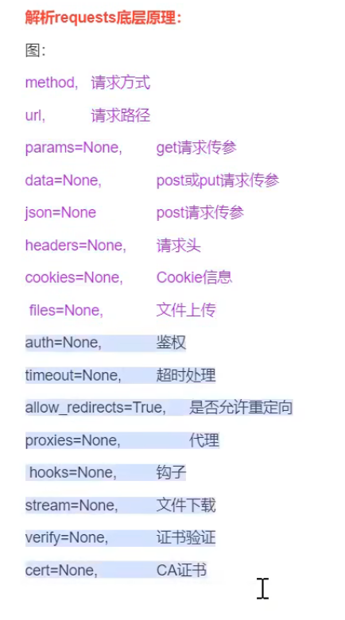
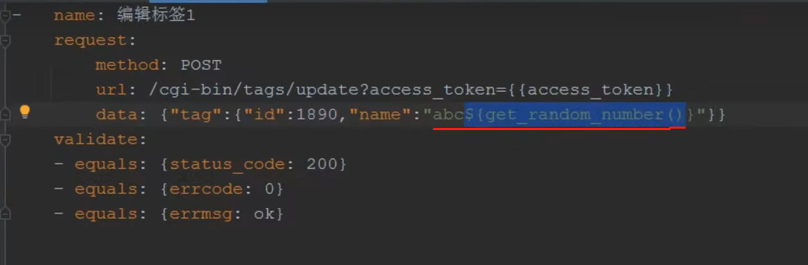
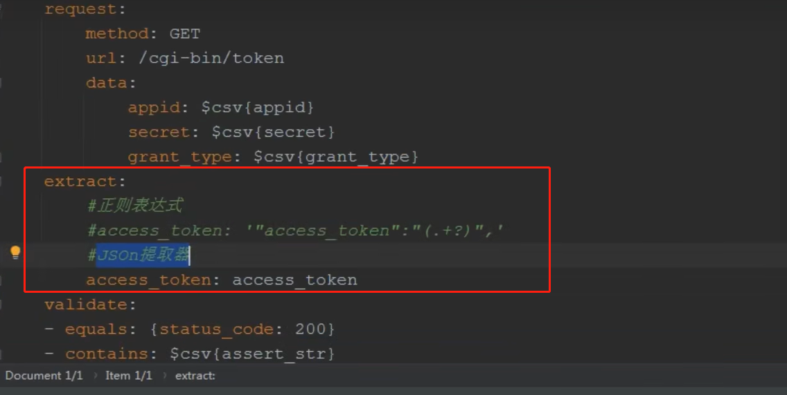
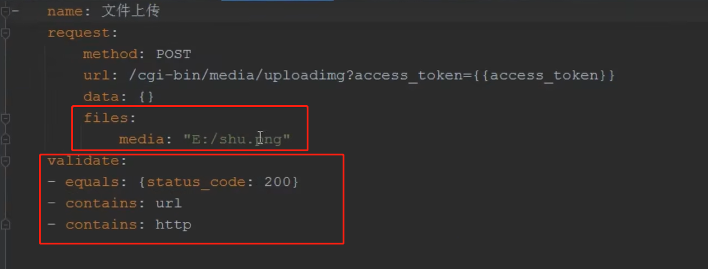
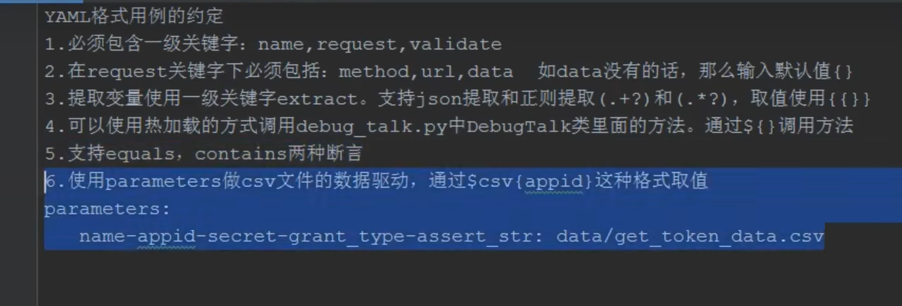

### 五、接口自动化测试框架封装
1. 接口自动化框架封装的第一步: 同一请求方式
* requests.request() 最核心的方法

### 关于get、post、put、delete的HTTP请求中，关于数据传递给服务器的编码方式如下:

#### 一、编码方式:

1. params 参数：通常用于GET请求，将参数编码到URL中作为查询参数。这些参数通常是简单的键值对。
   这将产生一个URL，类似于 https://example.com/api/resource?key1=value1&key2=value2。
2. data 参数：通常用于POST请求，将数据编码为表单数据（application/x-www-form-urlencoded）。
   这些参数也是键值对，但数据将包含在请求体中。数据是以表单数据的形式编码，类似于 HTML 表单提交。
3. json 参数：也通常用于POST请求，但它将数据编码为JSON格式，而不是表单数据。这使得它适用于发送复杂的数据结构，如嵌套的JSON对象。

#### 二、如何知道服务器期望的是哪种数据编码方式：

1. 请求头 Content-Type：检查API的请求头中的 Content-Type 字段。
2. 如果它设置为 application/x-www-form-urlencoded，则表明服务器期望表单数据形式的数据。
3. 如果它设置为 application/json，则表明服务器期望JSON格式的数据。
4. 服务器响应：如果你发送了错误的数据格式，服务器通常会在响应中返回错误消息。根据错误消息，你可以了解服务器期望的数据格式。

#### 三、统一接口请求封装

1. 因为：如果我们需要丢所有的请求做分析处理，日志监控
   目前学到的还只是第一个层次的封装

2. 打通接口自动化还需要掌握哪些技能？
3. 遗留问题:
* YAML文件里面没有办法使用动态参数： （可以通过在Yaml调用外部的方法解决）

* YAML文件里面没有办法使用文件上传(直接在Yaml里面写文件路径即可)
* 测试用例太多,每一个都要断言,太多怎么办？ （在Yaml文件里面实现）

* YAML文件里面数据量太大的话,该怎么办？（使用csv）

* 接口关联(支持正则提取以及json提取)

4. 深度思考:
   目前市面上80%的测试工程师都不知道写代码,只会简单的,接口自动化测试框架能不能封装得更加彻底,彻底到让
   不懂代码功能测试只要安装我们框架的规则去写yaml文件就可以实现接口自动化测试呢？

5. 实际企业接口自动化框架最终需要封装成什么样？

### 最终的Yaml格式用例基本可以解决上述的问题:

